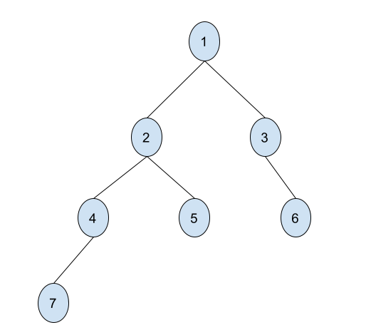
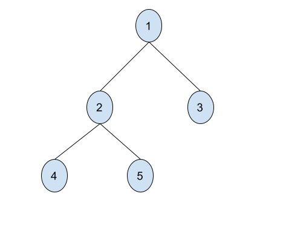
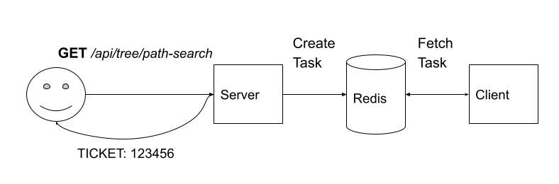
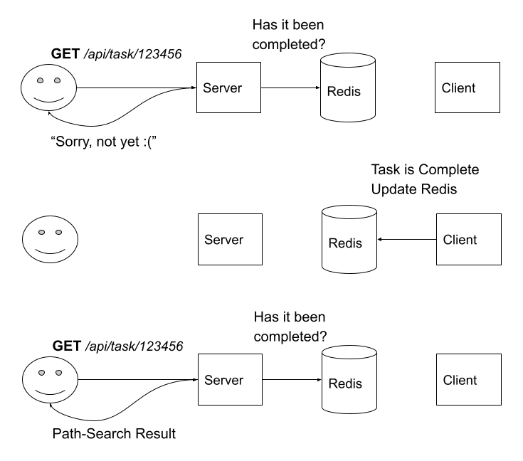
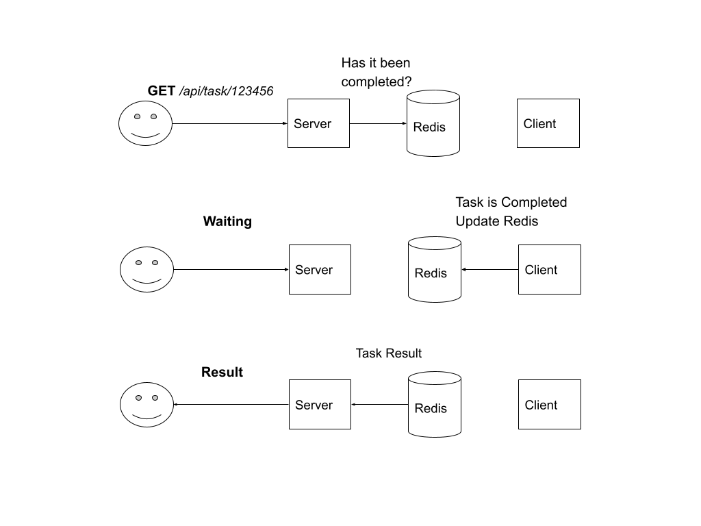

<p align="center">
    
</p>

# 1 - Path Search

You are given a tree where each node is identified by a unique integer value. <br /> 
You must write a function that returns all of the unique pathways from the tree's<br />
root to each of the nodes specified by the values in a given array.



For example, in the picture presented above, when given the values [5, 4, 3] your function<br />
should return the following array:

```["1->2->5", "1->2->4", "1->3"]```

If a path is contained within another then it should be excluded from the returned list. For<br />
example when given the values [4, 7] the aforementioned function should return:

```["1->2->4->7"]```

and not

```["1->2->4", "1->2->4->7"]```

since "1->2->4" exists within the "1->2->4->7" path.

You should write your code in the designated [file](./test_1//path_search.js). Your solution<br /> 
should run in O(n) and it is advised to use recursion. You should **not** define trees with duplicate<br />
Node ids.


# 2 - Path Search Server

Use [ExpressJS](https://expressjs.com/) in order to develop an HTTP server which listens for <br />
incoming requests on Port 7070. You should implement the API: **GET** ```/api/tree/path-search```.<br />
The aforementioned API call expects two parameters:
1. **tree**: A stringified JSON object representing a tree structure. It is defined as follows:
    * The tree node ids are depicted as the keys of the object
    * If a tree node has kids then its value should be an object
    * The keys of the objects under a tree node are the ids of its children tree nodes
    * If a tree node does not have any kids then its value should be null

    For example the object 
    
    ```{ 1 : { 2 : { 4 : null, 5 :null}, 3 : null}}``` 
    
    represents the following tree:

    

2. **pathsToFind**: An array with nodes to search for in the tree. The server uses the function<br /> 
developed in the previous exercise in order to calculate and return the paths in the tree based<br />
on the **pathsToFind** variable.

The folder [test_2](./test_2/) contains some basic configuration for your Server. You may use the<br /> 
function provided in the [src/utils.js](./test_2/src/utils.js) file (**jsonTreeToTree**)in order<br /> 
to transform the **tree** parameter into a Tree Node structure similar to the one of the previous<br /> 
exercise.

When the server is complete you may test it by building the docker image and then running it in the<br /> 
background:

1. ```docker build. -t path_search_server```
2. ```docker run -p 7070:7070 -d path_search_server```

You can use [Postman](https://www.postman.com/) in order to send API requests.

Example:
```
GET <host>/api/tree/path-search?tree="{1:{2:{4:null,5:null},3:null}}"&pathsToFind[]=4&pathsToFind[]=5
> [“1->2->4”, “1->2->5”]
```

# 3 - Path Search Task Based Approach

Similar to Task 2 but the computation of the path should not happen on the server itself but on a<br />
separate worker. You should use [Bull](https://www.npmjs.com/package/bull), a Task Manager based on [Redis](https://redis.io/).<br /> 
The workflow is described below:

1. Client makes a GET _/api/tree/path-search_ request
2. Server receives the request and creates a task for it. It then returns a ticket (a random integer) to
    the Client.

    

3. The worker fetches the task and calculates the answer. When the answer is created theclient writes it in<br />
    Redis (use [ioredis](https://www.npmjs.com/package/ioredis) as a redis client).
4. The client sends a message to another API: GET _/api/task/<ticket>_ to check if the job has been completed and<br /> 
    to see its result. The server should check whether the worker has finished the job and inserted its result into<br /> 
    redis. On success it should return the result back to the client. If the worker has not finished the task execution<br /> 
    yet it should return a message to the client.
    
    

In this exercise you have to do the following:
1. Research Bull and its usage
2. Update the [server project](./test_3/server/) and insert two new APIs:
    * _ GET _/api/tree/path-search_ : Similar to test 2, however it now creates a Bull task and returns an integer (ticket)<br /> 
        to the client
    * GET _/api/task/<ticket>_ : Where _ticket_ is an integer. This api call checks the Redis Storage to see if a task is<br /> 
        complete (you can use the ticket id to uniquely identify the Redis entry)
3. Update the [worker project](./test_3/worker/). You should create a task handler which performs a computation identical<br /> 
    to this of the second exercise. After the calculation of the result it should store the data in Redis.

You can use the existing docker-compose file for the development (simply execute the command: ```docker-compose up```)

# 4 - Bonus

Make the necessary changes to the previous architecture so that the server responds to GET _/api/tree/path-search_ requests<br /> 
directly with the results calculated by the worker. The API request should stay open until the worker asynchronously<br /> 
calculates and stores the answer in redis.


